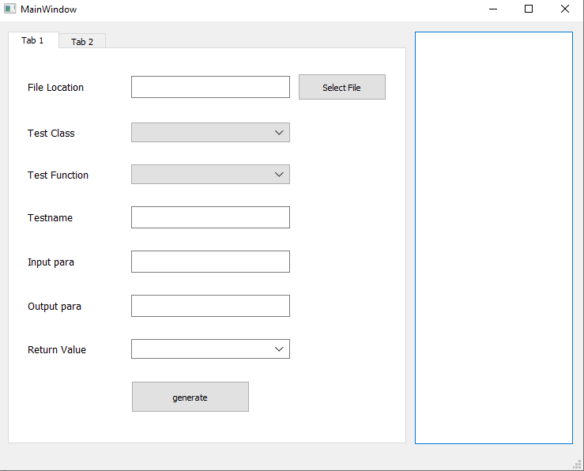

AutoToolForFocusTest
========

Let's introduce how the Auto Tool app works.

## Start

1. Start from exe

Run pyinstaller main.py to generate exe.
Run .\dist\main\main.exe directly.

2. Start from Python

Install prerequisite modules first, including Pyside2, pandas.
**main.py** is the starting module. Try to start Program from running this module.

## Usage

### MainWindow

As you can see, MainWindow contains an area for input data and a log window.

*[MainWindow]*

For each TextEdit field, users should satisfy certain requirements.
1. File Location:Choose the file which defines the classes for test. Path should include 'media\media_embargo\media_driver_next'.

2. Test Class:Tool will list all the classes parsed from the file you set, and you can choose which class you want to test.

3. Test Function:Tool will list all the functions defined in the class, including those inherit from father classes, and you can choose which function you want to test.

4. Testname:Create test name for this test.

5. Input para:Input parameters for this test. If you have multi parameters, separate with comma. And you're expected to set the value of each parameters for the test case generation.
Note that.
a)string or char parameter value should contain "" or ''.
b)You should not omit 'std::'.
c)std::vector currently supported.
A example: bool brcInitFlag=true,bool brcUpdateFlag=true,uint8_t passNum=2,uint8_t pipeNum=2, std::vector<std::string> packetId = {"Av1VdencPacket", "Av1VdencPacket"}

6. Output para
Output parameters for this test, format is the same as Input para. The value you set will be used as output reference for the test.

7. Return Value
expected return value for this test. You can choose from drop-down box or set other data as you want.

After set all the items, click "Generate", xml will open up automatically. You can refer to log window on the right side to find locations of dumped files.
Generated Files include(File path is shown on the console).
1.Focus test code: test.cpp, test.h, test_case.cpp, test_cast.h, test_data.h
2.dat file(input, output and returnValue), and modify resource.h & media_driver_codec_ult.rc
3.modify or generate ult_srcs.cmake

Package issue
-------
PyInstaller can bundle a Python application and all its dependencies into a single package.
Users then can run the packaged app without installing a Python interpreter or any modules. Now PyInstaller
works fine with this tool.

Ref: https://pythonhosted.org/PyInstaller/usage.html

1. After installing PyInstaller successfully, set your current directory to AutoToolForFocusTest/,
2. run command `pyinstaller main.py`. See carefully if there reports any error, try to fix it.
For example, if pyinstaller says `ModuleNotFoundError: No module named 'win32com'`, then use `pip install pypiwin32`
to install the missing module.
3. If things go smoothly, you could run .\dist\main\main.exe directly.